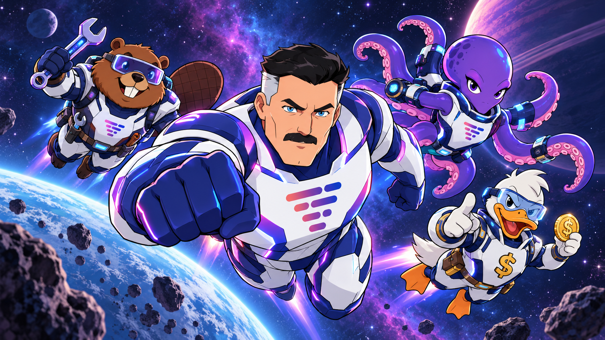

# Omni Loop



Omni Loop turns product plans into delivered software across Vertuoza's engineering repositories.
A PM writes a PRD. The PRD becomes a plan of waves and slices, and coding agents deliver it. Anyone with a
coding-agent slot can lend it to a PRD they do not own.

On top of that delivery sits a game. Each PRD is a **planet** the organisation terraforms together.
Unanswered questions, stuck slices and shipped bugs are **Entropy**, and they cost the owning team
points until someone closes them. The game only reads the delivery layer and can be removed
without touching it (`game/`, `.github/workflows/game.yml`).

- Design: [`docs/superpowers/specs/2026-09-24-omni-plan-game-design.md`](docs/superpowers/specs/2026-09-24-omni-plan-game-design.md)
- Game layer reference: [`game/README.md`](game/README.md)
- The galaxy arcade (web UI, Vercel + Supabase): [`apps/galaxy/README.md`](apps/galaxy/README.md)

## Repository layout

A pnpm workspace:

| Path | What |
|---|---|
| `kit/` | the delivery kit (`omni` CLI) |
| `game/` | the game layer: projector, ledger, economy, banner, rankings |
| `packages/design` | `@omni/design`: the design system — the palette, hand-placed pixel sprites, the planet renderer |
| `packages/galaxy` | `@omni/galaxy`: folds ledger events into the galaxy view; the demo world |
| `apps/galaxy` | `@omni/galaxy-app`: the OMNI LOOP arcade, a Next.js app for Vercel |
| `supabase/` | the game's database and source of truth: migrations, access checks, config, demo seed |

## Getting started

### Prerequisites

- Node 22 or later, and pnpm
- The GitHub CLI, logged in: `gh auth status` (read access to the `vertuoza` organisation)

### Install and test

```bash
pnpm install
pnpm test
```

The tests run entirely on fixtures and never call GitHub.

### Open the galaxy

```bash
pnpm galaxy:dev            # http://localhost:3000 — the arcade, on the demo galaxy
```

With a local Supabase, Vercel deployment and the artifact build: [`apps/galaxy/README.md`](apps/galaxy/README.md).

### Describe your repositories and fleets

Everything the game knows lives in Supabase ([`apps/galaxy/README.md`](apps/galaxy/README.md)),
and belongs to a **workspace**: Vertuoza is the workspace `vertuoza`. Repositories are grouped into
**sectors** and the **fleets** are rows in `teams`, both of a workspace, and both changed by a
migration in `supabase/migrations/`:

```sql
insert into public.sectors (workspace_id, name, repos)
select id, 'core-belt', array['vertuo-core', 'vertuo-api'] from public.workspaces where slug = 'vertuoza';
insert into public.teams (workspace_id, name, label, color, motto, mascot, home, sort)
select id, 'pirates', 'PIRATES', '#2fc6a4', 'Takes the zones nobody claims.', 'pirate', 'core-belt', 50
  from public.workspaces where slug = 'vertuoza';
update public.teams set retired_at = now()                                    -- retire, never delete
 where name = 'invincible-team' and workspace_id = (select id from public.workspaces where slug = 'vertuoza');
```

The fleets today: BEAVER, OCTOPOD, PICSOU, C.I.A. and PIRATES. People join one in the arcade: they
sign in with their `@vertuoza.com` Google account, which makes them members of the `vertuoza`
workspace, pick a fleet, enter a name, build a hero and link their GitHub account, and from then on
their pull requests score for that fleet.

### Run it by hand

With `SUPABASE_URL` and `SUPABASE_SERVICE_ROLE_KEY` set (locally: `npx supabase status`). Each
command reads and writes one workspace, named by `--workspace <slug>` or, failing that, by
`OMNI_LOOP_WORKSPACE`; there is no default:

```bash
pnpm game:banner 2332 --workspace vertuoza      # one planet's banner, read live from GitHub
pnpm game:project --workspace vertuoza          # snapshot the workspace's GitHub and append new events to its ledger
pnpm game:score --workspace vertuoza            # fold its ledger into this month's season
pnpm game:export backup/ --workspace vertuoza   # its row, ledger, sectors, fleets and players as JSONL
```

`game:project` writes permanent history. Run it against production only once the sectors hold the
real repositories.

### Switch on the scheduled workflow

The workflow polls every 15 minutes and posts rankings every Monday. It does nothing until it is
switched on. The token, rankings issue and `GAME_ENABLED` steps are described in
[`game/README.md` › Setup](game/README.md#setup).
