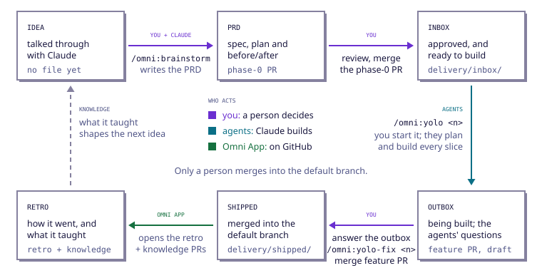
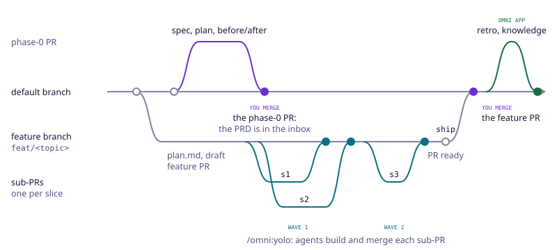
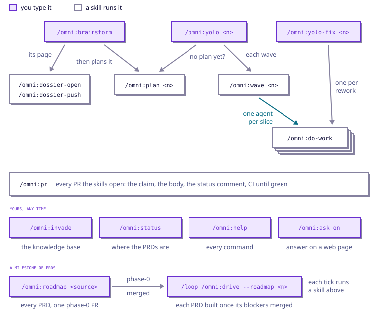

One PRD goes around one loop, from an idea to a retro. At three points it waits for a person;
everywhere else, agents do the work, and write down every decision they took without you. This page
shows the loop three ways: its stages, its pull requests, and its skills.
[Use cases](/docs/use-cases) then says what to type for each thing you want to do.

## The loop, stage by stage



| Stage | What it means | Where you see it | What moves it on |
|---|---|---|---|
| **idea** | talked through with Claude, nothing written yet | your Claude Code session | `/omni:brainstorm` writes the PRD |
| **PRD** | a spec, a plan and a before/after page, waiting for a person's approval | the PRD issue, the phase-0 pull request | you merge the phase-0 pull request |
| **inbox** | approved, ready to build | `.omni-loop/delivery/inbox/` | `/omni:yolo` builds it |
| **outbox** | being built; what the agents decided alone waits for you | the feature pull request, a draft | you answer the questions, then merge the feature pull request |
| **shipped** | the change is on the default branch | `.omni-loop/delivery/shipped/` | the Omni App opens the retro and knowledge pull requests |
| **retro** | how the delivery went, and what it taught | the retro and knowledge pull requests | you merge them, and the next idea starts from what they keep |

Three rules hold the loop together:

- **The folder is the status.** A PRD's folder sits in the inbox until it ships, and in the shipped
  folder after. `omni prd` followed by a PRD's number says where it is, and every skill looks there
  before it acts.
- **Only a person merges into the default branch.** The agents merge slices into a PRD's feature
  branch, never further. The phase-0, feature, retro and knowledge pull requests are yours to merge.
- **Every decision an agent takes alone becomes an outbox item,** which you answer or adopt. Nothing
  is decided behind your back, and nothing stops a build to wait for you.

## Your three gates

1. **The phase-0 pull request.** Merging it approves the PRD and puts it in the inbox, on the
   default branch (why, below). It holds documents only, no code: this is the cheapest moment to
   change your mind.
2. **The outbox.** When the build is done, the feature pull request lists every question the agents
   met, in plain words, each with the option they built (always A) and the others. You answer them
   all in one comment, and `/omni:yolo-fix` rebuilds what you changed. The lighter decisions are
   adopted as each wave merges: they stand unless someone objects later.
3. **The feature pull request.** It is marked ready for review once no question is left open. Its
   description says what was built, how it was checked, the risk and how to roll it back. Merging it
   ships the PRD.

Between two gates, nothing asks you anything. Only two things hold a slice: a confirmed rule of your
knowledge base it would break, and an action only a person can take, such as adding a secret. Both
come back to you with what to do.

### Why the phase-0 pull request goes into the default branch

The PRD's feature branch already holds the spec, the plan and the before/after: `/omni:brainstorm`
wrote them there. The phase-0 pull request carries the same files, byte for byte, into the
**default branch**, and it is that merge which puts the PRD in the **inbox**. It matters for four
reasons:

- **The inbox is read on the default branch.** The folder is the status, and `omni status`, the
  status line and every teammate's checkout read the folders from the default branch. Until the
  phase-0 pull request is merged, they show the PRD as `in review`: counted apart, not yet
  approved. Once merged, its folder sits in `.omni-loop/delivery/inbox/` for everyone: approved,
  ready to build.
- **The merge is the approval, on record.** Only a person merges into the default branch. The merge
  says who approved which spec and which plan, and when, before a line of code was written.
- **The next PRDs can build on it.** Every new PRD starts from the default branch, so from then on
  it can read this spec and this plan, and name this PRD among the ones it waits for
  (`blocked-by`), which the kit accepts only for a PRD already in the inbox or shipped.
- **The feature pull request stays about the code.** Before it ships, `/omni:yolo` merges the
  default branch into the feature branch; the two copies of the documents are identical, so they
  reconcile to nothing. The feature pull request then shows what changed since the approval: the
  code, and the PRD's folder moving from `inbox/` to `shipped/`. You read the documents once, at
  phase 0, and the code once, at the end.

## The pull requests you will see



Every PRD opens the same few issues and pull requests, each with its label:

| Label | What it is | Opened by | Merged by |
|---|---|---|---|
| `omni:prd` | the PRD's issue: its number is the PRD's number | `/omni:brainstorm` | closed when the PRD ships |
| `omni:phase-0` | the PRD's folder alone: spec, plan, before/after | `/omni:brainstorm` | you, into the default branch |
| `omni:feature` | the whole change: a draft until no question is open | `/omni:plan`, run by `/omni:brainstorm` | you, into the default branch |
| `omni:sub` | one slice, or one rework | `/omni:wave`, `/omni:do-work` | the loop, into the feature branch |
| `omni:retro` | how the delivery went | the Omni App, once shipped | you |
| `omni:knowledge` | the decisions you settled, written back into the knowledge base | the Omni App, once shipped | you |

The retro and knowledge pull requests open only when the delivery taught something worth keeping.
Three more labels say a state rather than a kind:

- **`omni:in-progress`**: an agent is working on this pull request right now. Leave it be.
- **`omni:needs-fix`**: a slice or a check stayed red after its tries. Its status comment says what
  a person must do.
- **`omni:outbox-go`**: a person lets the outbox gate pass while questions are still open. The loop
  never adds it.

Each of the loop's pull requests carries a status comment, kept current: where it is, and the steps
left to a person.

## Slices and waves

The PRD's plan, `plan.md`, cuts it into thin slices. Each slice has a **territory**, the files it
may touch; the slices it waits for; and a **wave**. The slices of a wave are built side by side,
each by its own agent in its own copy of the repository, each ending in its own sub-pull request.
The loop merges them into the feature branch one at a time, checks the wave as a whole, then starts
the next wave.

A slice that stays red after its tries gets `omni:needs-fix`; it holds only the slices that wait for
it, and the rest go on. To see a PRD's slices, which are merged, in flight, stuck, ready or waiting,
and what can run next:

```bash terminal agent
omni board 7
```

## Which skill runs which



| Skill | Type it when | It ends with |
|---|---|---|
| `/omni:brainstorm` | you have an idea | the PRD issue, the phase-0 pull request and the draft feature pull request; its last line is the `/omni:yolo` line |
| `/omni:yolo <n>` | the phase-0 pull request is merged | every slice merged into the feature branch; the feature pull request ready, or questions for you |
| `/omni:yolo-fix <n>` | you answered the questions | what you changed rebuilt, and the feature pull request ready |
| `/omni:plan <n>` | a PRD has no plan yet; `/omni:yolo` runs it for you | `plan.md`, and the draft feature pull request |
| `/omni:wave <n>` | you want one wave at a time; `/omni:yolo` runs it for you | the wave's slices merged into the feature branch |
| `/omni:do-work <n> <slice>` | you want one slice alone; `/omni:wave` runs it for you | one sub-pull request into the feature branch |
| `/omni:pr` | a pull request of the loop is red or conflicts; the skills run it for you | the pull request green, or stuck, with the reason |
| `/omni:invade` | once, after the install; with `--refresh` when the repository has changed a lot | one docs pull request: the knowledge base |
| `/omni:status` | you want to see where the PRDs are | one screen |
| `/omni:help` | you want to know what a command does | one screen |
| `/omni:ask on` | you would rather answer Claude's questions on a web page | the page's link |
| `/omni:dossier-open`, `/omni:dossier-push` | never: `/omni:brainstorm` and `/omni:plan` run them | the PRD's page on the Omni page |

Every skill, what it does and when to use it: [Skills](/docs/skills).

Given a name, `/omni:help` explains one skill or command: `/omni:help yolo`.

## In a terminal

A few `omni` commands are for you, in a terminal at the root of the repository or from Claude Code
with `!` before them. None of them changes anything, except `omni signin` and `omni update`.

| Command | What it says |
|---|---|
| `omni status` | where the repository's PRDs are, read from git; with `--fetch`, fetched first |
| `omni status 7` | whether PRD 7 still has open questions: its outbox gate |
| `omni prd 7` | where PRD 7 lives, and its files |
| `omni board 7` | PRD 7's slices, and what can run next |
| `omni kb show briefing` | one form of the playbook, as the agents read it: `briefing`, `testing`… |
| `omni knowledge BR-QUOTE-1` | one rule of the knowledge base, by its id |
| `omni signin` | signs this laptop in to the Omni page |
| `omni version` | which kit the repository runs, and whether a newer one exists |
| `omni update` | opens the pull request that brings the repository to the newer kit |
| `omni help` | every command, on one screen |

The skills run the others themselves, such as `omni ship` or `omni adopt`: you never need to.

[Next → Your first PRD](/docs/first-prd)
