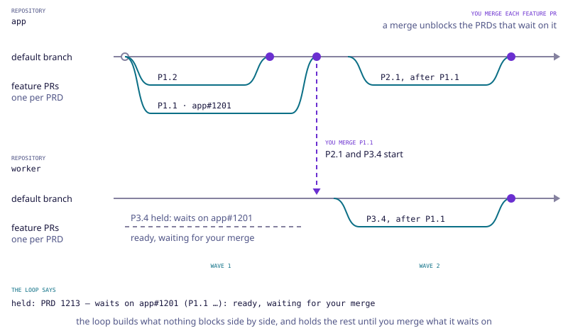

Large work is rarely one PRD. A milestone ("a company grants its first mandate after a trial week")
takes a dozen or more, some waiting on others, often across several repositories. Writing each one
through `/omni:brainstorm` means a design conversation per PRD for decisions your plan already took.

A **roadmap** is the milestone as its own object: a set of normal-sized PRDs, each blocked only by
the PRDs it really needs, every blocker saying why. You write it in one sitting, a person reviews it
in one pull request, and the loop drives it to the end.


Twice a person decides: the phase-0 pull request, once for the whole roadmap, and each PRD's feature
pull request, as it comes. Everything between is the loop's.

## Write a roadmap

Give the skill the plan you have: a page link, a file in the repository, or the text pasted in.

```text agent
/omni:roadmap docs/plans/crew.md
```

In a **plan repository**, whose PRDs land in other repositories, use its twin, which also reads each
target repository (from a read-only clone, in which nothing runs) and says where each PRD lands:

```text agent
/omni:mega-roadmap https://example.com/crew-plan
```

Each refuses the other's kind of repository, printing the line to type instead.

The skill reads the plan and shows **one map**: every PRD it will write, what blocks each and why,
the wave each sits in, the open questions, and anything the check would refuse, already fixed. You
answer the whole map in one message; nothing is written before that, and nothing is asked after.

Then it writes, for every PRD, its issue, its inbox folder, its spec and its before/after page, with
the spec's `blocked-by` taken from the map. **Specs are written up front, plans are not:** each PRD
is planned when the loop reaches it, against the code that exists then. A plan written today for the
last phase would describe code nobody has written yet.

It opens the roadmap's issue, writes `roadmap.md`, checks it with `omni roadmap check` and the inbox
with `omni check inbox`, and opens **one phase-0 pull request** holding the roadmap and every PRD's
folder. Merging it approves the whole roadmap at once. It ends with the line that drives it.

## roadmap.md

The roadmap lives in the inbox, in a folder named after its issue, under `roadmaps/`:

```markdown file=.omni-loop/delivery/inbox/roadmaps/1200-crew/roadmap.md
---
roadmap: 1200
title: Vertuoza Crew — from skeleton to earned autonomy
milestone: A company grants its first mandate after a trial week.
product: Crew
target: 2026-12-18
source: https://example.com/crew-plan
---

## PRDs

| id | PRD | title | blocked by | why | wave |
|---|---|---|---|---|---|
| P1.1 | #1201 | Crew API and worker skeleton | – | – | 1 |
| P3.4 | #1213 | Stateless think endpoint | P1.1 | the endpoint is called by the worker | 2 |

## Open questions

| id | question | recommendation | blocks | kind |
|---|---|---|---|---|
| Q2 | Which model answers first? | the smallest that passes the evals | P3.4 | default |
```

### Its front matter

| field | what it holds |
|---|---|
| `roadmap` | the roadmap issue's number; it matches the folder's number |
| `title` | the roadmap's name, as the Roadmaps page lists it |
| `milestone` | the one sentence that says when the roadmap is done |
| `product` | optional: a product of your workspace, by its name. The Roadmaps list filters by it. A name the workspace does not have files the roadmap under no product, and `omni roadmap push` says so in one line |
| `target` | optional: a date a person gave, written `YYYY-MM-DD`. It is shown as given; the loop never computes one |
| `source` | optional: where the roadmap was read from, such as the plan's link. The roadmap's page links it |

Nothing else goes in the front matter.

### Its tables

- **Blockers are the narrowest the plan justifies.** A PRD waits for the whole previous phase only
  when the plan says nothing finer, and every blocker carries its `why`.
- **The wave** is 1 with no blocker, else one more than the highest blocker's wave.
- **A question's kind:** `default` runs on its recommendation, written into each blocked PRD's spec
  and accepted when the phase-0 pull request merges; `person` parks the PRDs it blocks until someone
  answers it.
- In a plan repository the PRDs table gains a `repos` column naming the target repositories each PRD
  lands in, by their short name. A target marked `readOnly` can never be named, and a PRD in a target
  that `consumes` another comes after the PRDs it waits on that change that other target:
  [Read-only and consumer targets](/docs/several-repositories#read-only-and-consumer-targets).

## What the check refuses

`omni roadmap check` reads every roadmap of the inbox, or one with its number
(`omni roadmap check 1200`), prints its PRDs wave by wave, then each thing it refuses, naming the row
or the question. `omni check inbox` runs it on every roadmap of the inbox.

```bash terminal agent
omni roadmap check 1200
```

It refuses a `roadmap.md` it cannot read:

- no front matter; a missing `roadmap`, `title` or `milestone`; a field that is not one of the six; a
  `target` that is not a `YYYY-MM-DD` date;
- no `## PRDs` section, no table in it, or a column missing from either table;
- an id, or an id in a `blocked by` or `blocks` cell, that is empty or holds a space, a comma or a
  pipe; a `PRD` cell that is not `#<number>`; a row with no title; a wave that is not a positive whole number; a question with no words, or whose
  kind is neither `default` nor `person`.

And a roadmap whose rows do not hold together:

- a `roadmap` number that does not match its folder's;
- an id used twice, among the PRDs and the questions together;
- a blocker that is not a row of the roadmap;
- a cycle among the blockers;
- a wave out of order: not 1 with no blocker, or not one more than the highest blocker's;
- a blocker without its `why`;
- a row whose PRD has no folder in the inbox or the shipped folder, or whose spec does not read;
- a spec whose `blocked-by` differs from its row's blockers;
- a question that blocks a row the roadmap does not have.

In a plan repository, also:

- no `repos` column, or a row that names no repository;
- a repository that is not a target of `plan.targets`, or one marked `readOnly`;
- a PRD in a consumer target in a wave not after a PRD it waits on, directly or through others, that
  changes a target it consumes. PRDs that do not wait on each other may share a wave.

Outside a plan repository, a `repos` column is refused.

A PRD's row still passes once that PRD has shipped: its folder counts in the inbox or in the shipped
folder, and its spec is compared wherever it lives. A roadmap does not fail its check because its
first PRD merged.

## Prerequisites

A roadmap is driven for hours, and it stalls on things nobody wrote down: a company package the
install cannot reach, a laptop with no Docker for the database tests. The **prerequisites** say what
has to be true on the machine, on GitHub and around the repository before the PRDs can be built.
The loop checks them, fixes the ones it safely can, and lists the rest for you, each with the command
to copy and who can do it.

### The table

An optional `## Prerequisites` section of `roadmap.md`, after `## Open questions`:

```markdown file=.omni-loop/delivery/inbox/roadmaps/1200-crew/roadmap.md
## Prerequisites

| id | category | need | check | fix | blocks | who |
|---|---|---|---|---|---|---|
| p1 | permissions | gh is signed in, with the right to change the repository | `base:gh-auth` | | all | check |
| p4 | access | the libraries install from the lockfile | `base:install` | `base:install` | all | agent |
| p6 | local | Docker is running, for the database tests | `base:docker` | | P1.1, P3.4 | check |
| p7 | permissions | the Vercel preview has `DATABASE_URL` | | | P3.4 | person |

### p6

- **Why:** The tests for this roadmap start a database in Docker. Without Docker running, they
  cannot run, and no slice can merge.
- **Command:** `open -a Docker`
- **What it does:** Starts the Docker app on your Mac. If it is not installed, get it from
  https://www.docker.com/products/docker-desktop and open it once.
- **Who can do it:** Anyone with this laptop.
```

| column | what it holds |
|---|---|
| `id` | `p1`, `p2`, …, unique in the table |
| `category` | where it holds, below |
| `need` | one plain sentence: what must be true, and for what |
| `check` | a base check `base:<name>`, a shell command that exits 0 when it holds, or empty when nothing can verify it |
| `fix` | empty, or a base fix `base:<name>` the loop may run itself: `agent` rows only |
| `blocks` | the `## PRDs` row ids it blocks, or `all` |
| `who` | `agent` (the loop checks it and fixes it), `check` (the loop checks it, a person fixes it) or `person` (nothing can verify it: a person ticks it) |

The **categories**:

- `local`: tools on the machine that runs the loop (Docker, Node, pnpm, git).
- `access`: registries, your company's own packages, other repositories.
- `permissions`: GitHub scopes, write access, secrets and environment variables.
- `github`: labels, workflows, branch settings, the Omni Loop app installed.
- `services`: a database, preview deployments, the Omni app sign-in.

Every `check` and `person` row has its **author card**, a `### <id>` under the table with exactly
four lines, **Why:**, **Command:**, **What it does:** and **Who can do it:**, written for someone who
is not technical: one command, the simplest that works on the author's computer, and who on the team
can do it when it is not you. In a plan repository a row may add a `repos` cell naming the targets it
concerns; a check on a target only reads, and never installs.

`omni roadmap check` refuses, naming the row: an unknown `category` or `who`, an id used twice, a
`blocks` naming no row, a `check` naming no base check, a `fix` on a row that is not `agent` or naming
no base fix, an `agent` row without a fix, a `check` or `person` row without its card, and a card
missing one of its four lines. A roadmap without the section checks as before.

### The base checks

| check | category | what it checks | what the loop may fix |
|---|---|---|---|
| `base:gh-auth` | permissions | `gh` is signed in, with the `repo` scope | – |
| `base:node` | local | Node is at least the version the repository needs | – |
| `base:pnpm`, `base:npm`, `base:yarn` | local | the repository's package manager runs | – |
| `base:install` | access | the dependencies install from the lockfile | runs the install |
| `base:registry` | access | the registry the lockfile names answers | – |
| `base:docker` | local | `docker info` answers | – |
| `base:labels` | github | the loop's labels exist | creates them, when `labels.autoCreate` is true |
| `base:env-file` | local | each `.env.example` has its `.env` | copies the example when the `.env` is missing, never over one |
| `base:omni-signin` | services | `omni` is signed in to the Omni app | – |

`/omni:roadmap` and `/omni:mega-roadmap` write the base rows into every roadmap, blocking `all`:
`base:gh-auth`, `base:node`, the package manager, `base:install` and `base:labels`. Then they read
each PRD for what it needs (a container, a company package, a secret, a service, a permission) and
add its rows and cards, show them on the map by category, and check them once the roadmap is
written.

**What the loop may fix:** only what is inside the repository or its own session and can be undone.
It never installs software, never starts or stops a system service, never writes a secret, a token or
a value it was not given, and never changes anyone's access. Everything else is a `check` row: the
loop checks it, you do it.

### Check them

```bash terminal agent
omni roadmap prereqs 1200 --fix
```

It runs every row on this machine, each check within 30 seconds; a check that times out or crashes
is not ok, never passed. With `--fix` it runs the `agent` rows' fixes once, then checks them again.
It prints one line per row, grouped by category: `ok`, `fixed`, `ticked`, or `waits on you` with its
card's command, sends the result to the roadmap's page with this machine's name and the time, and
exits 0 once every row is ok, fixed or ticked.

A `person` row is ticked once its author did it, from the page's **Mark as done**, or from a
checkout:

```bash terminal
omni roadmap tick 1200 p7
```

The drive runs `omni roadmap prereqs <n> --fix` on its first tick, and again before a PRD a
prerequisite holds would start. An open prerequisite holds only the PRDs it blocks, while every
other PRD keeps building:

```text agent
held: PRD 1213 — waits on prerequisite p6 (local): Docker is running, for the database tests
```

Once you fixed it, or ticked it, the next tick frees those PRDs. When nothing else can move, the
drive stops and lists each open prerequisite with its command.

### The Prerequisites tab

A roadmap's page has two tabs: **Overview** (below) and the **Prerequisites** tab. It shows a count
line (`7 ok · 1 fixed · 2 wait on you`), then the rows by category, those that wait on you first.
Each row shows its need, its state, the PRDs it blocks, and on which machine and when it was last
checked. A row that waits on you opens its card: the **Why**, the command with a **Copy** button,
**What it does** and **Who can do it**, so you can do it or forward it to the person it names. A
`person` row has **Mark as done** for a signed-in member of the workspace. A roadmap without
prerequisites says so in one line.

## Drive it

Once the phase-0 pull request is merged, drive the roadmap:

```text agent
/loop /omni:drive --roadmap 1200
```

or, in a plan repository:

```text agent
/loop /omni:mega-drive --roadmap 1200
```



Every PRD whose blockers have merged is planned and built; a PRD whose blocker is still open waits,
and says which pull request it waits on and where that one stands:

```text agent
held: PRD 1213 — waits on app#1201 (P1.1 Crew API and worker skeleton): ready, waiting for your merge
```

A blocker stops blocking when its feature pull request is **merged**, so a PRD always builds on
reviewed code: the pull request named is the one to review first. In a plan repository, a blocker
has merged once its plan pull request and every target pull request it lands in have merged.
[Drive the loop](/docs/drive#drive-a-roadmap) explains the loop itself.

## Answer a question

A `person` question parks only the PRDs it blocks. Answer it from a checkout of the repository:

```bash terminal
omni roadmap answer 1200 Q5 "Weekly, by email"
```

It posts one comment on the roadmap's issue, which records the answer; the latest answer to a
question wins. It takes only a question the roadmap lists, and an answer of up to 1,000 characters.
The next tick takes the parked PRDs up.

On the roadmap's page, each `person` question not answered yet has an **answer box**. It posts
nothing itself: you write your answer in it, and it builds the `omni roadmap answer` line for you,
with a **Copy** button and a link to the roadmap's issue. Run that line from your checkout.

## The Roadmaps page

The Omni app shows every roadmap of your workspace under **Roadmaps**, in the sidebar's Work group,
above PRDs. The loop sends it where each PRD stands: `/omni:roadmap` once the roadmap is written, the
drive after every tick (`omni roadmap push`). It needs your terminal signed in (`omni signin`); with
the app out of reach, the push prints one line and the loop carries on.

### The list

One card per roadmap: its title, its milestone, its product, how many of its PRDs have merged, how
many wait on your merge, its target date when a person gave one, and **what blocks it now**. That is,
first, each `person` question nobody has answered yet, then each pull request a PRD waits on, once
each: the shortest list of what to do to move it. A card shows three lines and says how many more;
the roadmap's own page shows them all. Above the cards, one chip per product of the workspace that
has a roadmap filters the list, beside **Every product**.

### A roadmap's page

At the top: its milestone, its progress, its repository, a link to its issue and to its source, and
what blocks it now. Its **Overview** tab holds its Gantt, its open questions and its PRDs, each
linking to the PRD's own page; its **Prerequisites** tab, what the loop needs before it can build
them: [The Prerequisites tab](#the-prerequisites-tab).

To read the Gantt:

- **One row per PRD, grouped by wave**, in the table's order.
- **An arrow from each blocker**, from the end of the blocker's bar to the start of the bar it blocks.
- **The colour is the state:** waiting (not started), building, outbox (its questions wait for you),
  waiting for merge, merged, and closed unmerged. The legend under the chart names each.
- **Before any PRD has merged, nothing is dated:** each bar sits in its wave's column.
- **Once one has merged, the bars are on dates.** A PRD that started is solid from its start, to its
  merge or to today, then dashed to its projected end. A PRD not started is dashed from the latest end
  of its blockers. The projection is the median length of this roadmap's merged PRDs: its own
  history, never an estimate made up.
- **In a plan repository, each bar has a lane per repository** the PRD lands in.
- **The pull request a PRD waits on is on its bar**, linked, until the PRD merges.

Under the Gantt, the **open questions**: each with its recommendation and the rows it blocks, the
answer once someone gave one, and the answer box for a `person` question still open.

[Next → Landings](/docs/landings)
