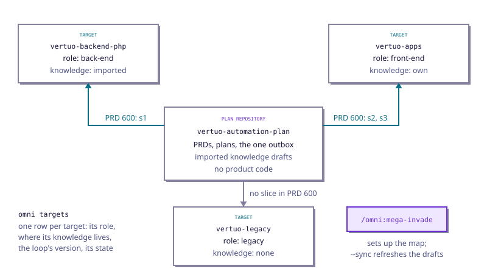

Some features land in more than one repository: the business logic in the back-end, the screen
that shows it in the front-end. The loop can plan and build such a feature from one place. This page
shows how, in three drawings: the repositories, the pull requests over time, and the skills. Learn
the loop on one repository first ([How the loop works](/docs/loop)); everything here builds on it.

## What it is

A **plan repository** holds the PRDs of such features, and no product code. Its **target
repositories** hold the code: each PRD's plan says, for every slice, the target it lands in. The
mode has one rule: **one plan, one phase-0, one gate**. You approve the whole feature once, in the
plan repository, and you answer every decision the agents took once, in the plan repository, while
the code's pull requests open in each target.

The example on this page is the same throughout: PRD 600 lives in `vertuo-automation-plan`; its
slice s1 lands in `vertuo-backend-php`, and s2 and s3 in `vertuo-apps`.

## The repositories



Each target has a **role**, one word such as `back-end`, `front-end` or `legacy`, and its knowledge
lives in one of three places: **own**, a knowledge base in the target itself, read where it lives;
**imported**, a draft of one written in the plan repository, under
`.omni-loop/knowledge/repos/<name>/`; or **none**.

### Set it up

Install the loop in the plan repository like any other repository
([Set up a repository](/docs/install#set-up-a-repository)), then, at its root, type:

```text agent
/omni:mega-invade
```

It reads the page of your plan repository that says which repository does what (a guide with one
`## <name>` heading per repository), and the targets its config already lists. It reads each of
them through GitHub, without cloning it, and shows you **one map**: whether each has the loop, its
version, and whether it has a knowledge base of its own. Then it asks, in one list, for each one:

- **target or not**, and its **role**;
- for a target without a knowledge base of its own, **import one or not**. Import reads a shallow
  copy of that repository, never runs anything in it, and writes the draft in your plan repository.
  A target that has its own is read where it lives, never copied.

It writes only in your plan repository, never in a target. It ends with one docs-only pull request:
the imported drafts, the `plan` section of `.omni-loop/config.yml` in a commit of its own, a table of
where each target stands, and, for each gap, the step to take in that repository:
`npx omni-loop init`, then `/omni:invade` there. You merge it.

From then on, to see where each target stands:

```bash terminal agent
omni targets
```

It prints one row per target: its role, where its knowledge lives, the loop's version, and its
state: `ok`; `stale` when an imported draft was read before a change to a file it was drawn from;
`drifted` when the config no longer says what the repository has; `unreachable` when GitHub will not
show it to you. It reads and never changes anything. To refresh the stale drafts, type:

```text agent
/omni:mega-invade --sync
```

It redraws only what changed, never rewrites what a person wrote, proposes to drop the draft of a
target that now has its own knowledge base, and opens one pull request, or none when there is
nothing to do.

### Read-only and consumer targets

The targets are listed under `plan.targets` in `.omni-loop/config.yml`. Two optional keys on a
target say what may change in it, and in what order:

```yaml file=.omni-loop/config.yml
plan:
  targets:
    - repo: vertuoza/vertuo-backend-php
      role: back-end
      knowledge: imported
      readAt: 3f9c2a7e1b0d4c8a9e6f5d2b1a0c9e8d7f6a5b4c
    - repo: vertuoza/vertuo-apps
      role: front-end
      knowledge: own
      consumes: [vertuo-backend-php]
    - repo: vertuoza/vertuo-legacy
      role: legacy
      knowledge: none
      readOnly: true
```

- **`readOnly: true`**: the loop still reads the target, surveys it and can import its knowledge, but
  nothing may land in it.
- **`consumes`**: the short names of the other targets whose packages this one installs, from their
  default branch. A change in such a provider reaches the consumer only once it has merged there, so
  it cannot be built in the same PRD as the code that uses it: it must be an earlier PRD. Only the
  targets the list names count; a chain through a third target is not followed.

Two checks hold them:

- **`omni plan check`** refuses a plan with a slice in a `readOnly` target, and a slice in a consumer
  target blocked by a slice in a target it consumes. Move the provider's change into an earlier PRD,
  and block this one on it.
- **`omni roadmap check`** applies them to a roadmap's rows: no row may name a `readOnly` target, and
  a PRD in a consumer target sits in a later wave than every PRD it waits on, directly or through
  others, that changes a target it consumes. The rule follows the blockers: two PRDs that do not wait
  on each other may share a wave. [What the check refuses](/docs/roadmaps#what-the-check-refuses).

### Name a product instead

When a [product](/docs/products) on the Omni page holds these repositories, the plan repository can
name it in place of its list: each link of the product is a target, with its role, knowledge, read
at, read-only and consumes. First copy the list into the product, once, from the plan repository:

```bash terminal agent
omni product import --product Mobile
```

Each target becomes a link of the product, a link that exists is changed to match, and it prints
what it added and changed; run again, it changes nothing. It stops at the first link the Omni page
refuses, naming why: fix it and run it again. It never edits your config: swap `targets` for
`product` yourself.

```yaml file=.omni-loop/config.yml
plan:
  guide: docs/repositories.md
  product: Mobile
```

A config names `product` or `targets`, never both: with both it is refused, naming the two keys.
`omni targets` then reads the product's links from the Omni page, signed in as you (`omni signin`),
and prints the same table. A link with no role is refused by name:
`vertuoza/vertuo-backend-php has no role in product Mobile: set it on the product page`. Each read
is kept in `.omni-loop/local/product-targets.json`: when the Omni page does not answer within five
seconds, `omni targets` reads that copy and says `targets from the last read, <date> · server
unreachable`; with no copy yet, it stops with `no targets: the server is unreachable and nothing was
read yet`. When the page refuses you, it stops with its reason.

For now only `omni targets` reads a product. The skills that plan and build across repositories, and
the commands they run, see no target when the config names a product: keep `plan.targets` in a plan
repository that builds, and name the product once they read it too. A config that keeps
`plan.targets` works exactly as before.

## Plan across them

Once the targets are set, plan a feature across them. In the plan repository, type:

```text agent
/omni:mega-brainstorm
```

It is `/omni:brainstorm` for several repositories: it talks the idea through with you, asks which
repository does what (it never assumes it), and reads each one it touches from a copy that nothing
runs in. It writes one PRD whose plan has a `repo` column: the repository of every slice. The spec,
the plan, the draft feature pull request and **one phase-0 pull request** all open in the plan
repository; nothing is written in a target, and no target gets a phase-0 pull request.

The phase-0 pull request adds a **What lands where** table, so each team finds its part: one row per
repository, with its role, its slices and the waves they sit in. Every team reads the whole feature
side by side before any code exists. A person reviews it and merges it, which puts the PRD in the
plan repository's inbox.

## The pull requests over time


Time runs left to right, as in the [single-repository drawing](/docs/loop#the-pull-requests-you-will-see).
The plan repository gets two pull requests: the one phase-0, and the **plan pull request**, its
feature pull request, which holds the one outbox and closes the PRD. Each target gets one **target
pull request**, built slice by slice through sub-pull requests the agents merge into it, wave by
wave. Every decision an agent takes alone in a target comes back to the plan repository's outbox.
The numbers are the order you merge in: each target pull request first, the plan pull request last.

## Build

Once the phase-0 pull request is merged, build the feature. In the plan repository, type:

```text agent
/omni:ultra-yolo 600
```

with your PRD's number. It is `/omni:yolo` for several repositories:

- it opens **one feature pull request in each target**, and builds every slice there as a sub-pull
  request into it, wave by wave;
- it **relays every decision** the agents took in a target into the one outbox of the plan
  repository, where you answer them all in one place;
- in a target it runs **nothing but that repository's own committed checks**, the ones its config
  names;
- it marks each target pull request ready once its CI is green, and the **plan pull request ready
  last**, after all of them;
- it tells you the **order to merge in**: each target's pull request first, in the order of their
  earliest wave, then the plan repository's, which closes the PRD.

It never merges into any repository's default branch. You do.

A PRD whose spec was merged without a plan, as a roadmap leaves them, is planned first: the plan says
which slice lands in which target, and `omni plan check` grades it before the first wave.

## Drive it

To leave several multi-repository PRDs building without typing each next command, drive them from
the plan repository:

```text agent
/loop /omni:mega-drive
```

It is [driving the loop](/docs/drive) for a plan repository: one step per tick, each running
`/omni:ultra-wave`, `/omni:ultra-yolo`, `/omni:ultra-yolo-fix` or `/omni:mega-pr-care --once`. A step
in one repository never waits for a step in another unless they touch the same path in the same
repository. When a PRD waits on you, the loop says so on the plan pull request, naming each pull
request still open by repository, and stops itself once nothing moves without you. With
`--roadmap <n>` it drives a roadmap's PRDs, each held until its blockers' plan and target pull
requests all merged. `/loop /omni:drive` in a plan repository prints this line instead.

## Which skill runs which


| Skill | Type it when | It ends with |
|---|---|---|
| `/omni:mega-invade` | once, in the plan repository; with `--sync` when an imported draft went stale | one docs pull request: the map and the imported drafts |
| `/omni:mega-brainstorm` | you have an idea that spans several repositories | the PRD issue, the draft plan pull request and one phase-0 pull request; its last line is the `/omni:ultra-yolo` line |
| `/omni:ultra-yolo <n>` | the phase-0 pull request is merged | a target pull request per target, ready; the plan pull request ready, or questions for you |
| `/omni:ultra-yolo-fix <n>` | you answered the questions on the plan pull request | each rework built in its own target, and the plan pull request ready |
| `/omni:ultra-wave <n>` | you want one wave at a time; `/omni:ultra-yolo` runs it for you | the wave's slices merged into their targets' feature branches |
| `/omni:mega-pr-care <n>` | the pull requests are open, after `/omni:ultra-yolo` or alongside it; leave it running | every pull request of the PRD, the plan's, each target's and each linked bug fix's, kept conflict-free, green and review-handled round by round, until each is merged or closed; it never merges |
| `/omni:mega-roadmap <source>` | a milestone takes several multi-repository PRDs, and you have its plan | every PRD's issue and spec, each saying where it lands, `roadmap.md`, and one phase-0 pull request; its last line is the `/loop /omni:mega-drive --roadmap` line |
| `/loop /omni:mega-drive` | several PRDs are merged into the inbox, or a roadmap with `--roadmap <n>`, and you want them built without typing each next command | each PRD ready, or parked on its plan pull request with what it waits on; the loop stops itself |
| `/omni:mega-bug-fix` | a bug shows in one target and its cause may sit in another; `--prd <n>` links it to a PRD | one bug issue with a fix plan, one fix pull request per target in merge order, provider first, and a record pull request that closes the issue, merged last |

`/omni:do-work` and `/omni:pr` are the same skills the single-repository loop runs: `--target`
builds a slice in its target repository, and `--repo` opens and follows its pull request there. You
never type either flag.

## A red gate

When the agents met questions, the plan pull request stays a draft, with the questions posted on it.
Answer them there, in one comment, as you would on one repository, then, in the plan repository,
type:

```text agent
/omni:ultra-yolo-fix 600
```

It reads your answers on the plan pull request and reworks each decision you changed **in the
repository it was taken in**: a sub-pull request into that target's feature branch. Then it runs the
same gate again, and marks the plan pull request ready once no question is left.

[Next → Roadmaps](/docs/roadmaps)
